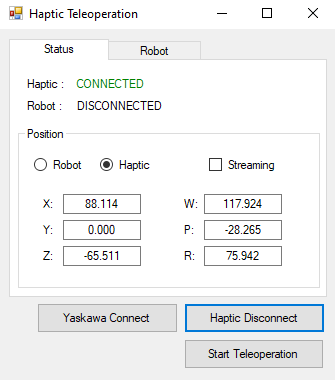
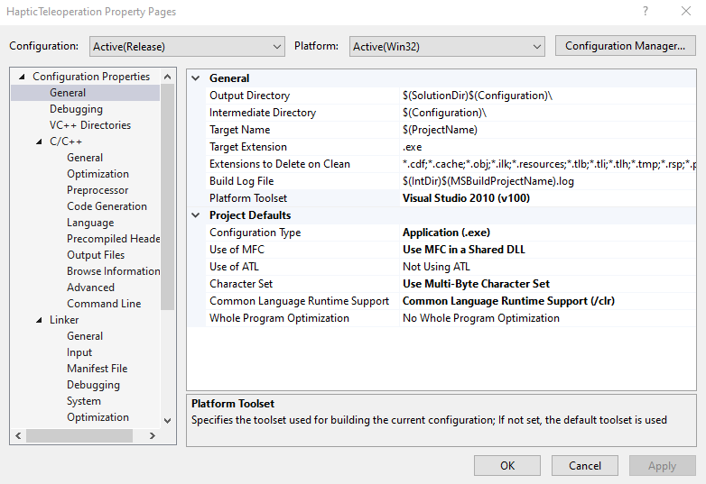

# YASKAWA-Robot-Teleoperation

An interface to control a YASKAWA GP7-YRC1000 industrial robotic arm through a teleoperation method. This project uses a 3DS Haptic Teleoperation device to control the robot. 

## Project configuration

The program is written in `Visual Studio 2019 C++`. However, we need to install Visual Studio 2010 since the haptic driver only supports the v100 platform toolset. 

1. Open the `Project`⮕`Properties`. In `General` set the properties as follow:
   * `Platform Toolset` : Visual Studio 2010 (v100)
   * `Use of MFC` : Use MFC in a Shared DLL
   * `Character Set` : Use Multi-Byte Character Set

2. In `C/C++` --> `General`, add these additional include directories:
   * C:\OpenHaptics\Developer\3.4.0\utilities\include
   * C:\OpenHaptics\Developer\3.4.0\Quickhaptics\header
   * C:\OpenHaptics\Developer\3.4.0\include
   
   
